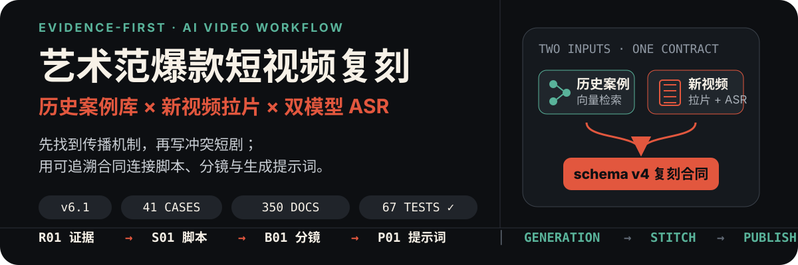
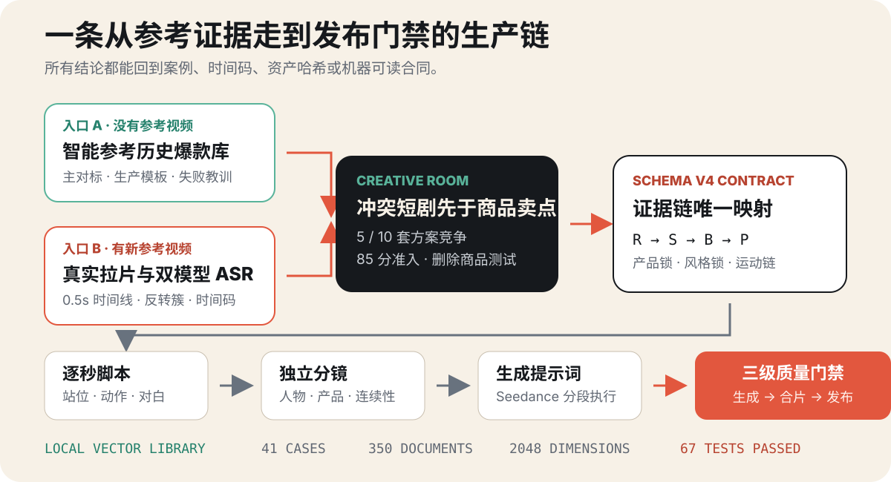

<p align="center">
  
</p>

<p align="center">
  <strong>不是一条万能提示词，而是一套证据驱动的短视频复刻生产系统。</strong><br>
  内置历史爆款向量案例库，也能对新视频真实拉片、识别字幕、设计剧情并执行分层质量门禁。
</p>

<p align="center">
  <code>v6.1</code> · <code>41 个正式案例</code> · <code>350 份案例文档</code> · <code>2048 维本地向量</code> · <code>67 项测试</code>
</p>

## 它解决什么问题

拿到一张商品图、一个团购卡券，或者一条想复刻的视频时，最难的通常不是“让模型生成画面”，而是：

- 应该参考哪种爆款机制，而不是凭印象套模板？
- 原片的第一秒钩子、误判、反转和结尾记忆点到底在哪里？
- 字幕识别出的内容究竟是角色对白、歌词还是误识别？
- 商品怎样成为剧情答案，而不是突然插入一段硬广？
- 脚本、分镜、提示词和最终视频如何逐项对应并验收？

这个 Skill 把这些问题变成一条可追溯的证据链：

```text
历史案例 / 新参考视频
        ↓
爆款机制与失败教训
        ↓
冲突短剧与创意竞争
        ↓
Rxx 原片节拍 → Sxx 新片脚本 → Bxx 分镜 → Pxx 生成提示词
        ↓
生成前 / 合片前 / 发布前质量门禁
```

## 两种入口，一套工作流

| 你手里有什么 | Skill 会先做什么 | 适合场景 |
|---|---|---|
| 只有商品、卡券或创作需求 | 检索内置向量案例库，给出主对标、生产模板、候选参考和失败教训 | 不知道该参考哪条爆款时 |
| 一条新的参考视频 | 锁定文件身份与 SHA-256，抽取时间线和关键帧，运行双模型 ASR，再拆解钩子与反转 | 要真实拉片或高保真复刻时 |

两条入口最终都会进入创意竞争、故事合同、逐秒脚本、独立分镜、Seedance 提示词和质量门禁，不会直接拼接历史脚本。

<p align="center">
  
</p>

## 看得到的结果

### 三条成片示意

#### 合肥银泰中心剧情示意（15.1 秒）

https://github.com/user-attachments/assets/cb8d828f-9289-4799-abb1-efbca9d052f7

#### 曲江银泰美妆示意（30.3 秒）

https://github.com/user-attachments/assets/374e3986-6e76-4e10-a48c-ffa38c77d10b

#### 合肥银泰一元请六国吃饭（37.2 秒）

https://github.com/user-attachments/assets/2b96de9b-346a-4b48-a9f7-b4fe9acacd6f

三条附件在 GitHub README 内可直接点击播放；同时保留了可下载、可校验的 [原始 MP4 文件](./examples/final-videos/)，其中列出了编码、时长与 SHA-256。它们展示最终可播放的视觉效果，不替代质量门禁，也不附带投放数据或“爆款”保证。

### 完整拉片案例：从参考视频到逐秒脚本与分镜

下面不是概念图，而是一份已完成的真实案例存档：将 18.067 秒的《眼儿媚》古风参考片，按“爆款机制迁移”改写为 30 秒、3 个 Clip、9 个新节拍、11 张独立分镜的生成设计包。

<p align="center">
  
</p>

<p align="center">
  
</p>

| 证据链环节 | 可直接查看的真实交付物 |
|---|---|
| 拉片与 ASR | [关键帧、审看范围与镜头分析](./examples/eyeermei-hefei-binhuhu-20260826/reference_analysis.md)；[双模型字幕差异](./examples/eyeermei-hefei-binhuhu-20260826/asr_evidence.md) |
| 机制迁移 | [R01–R09 → S01–S09 的结构映射](./examples/eyeermei-hefei-binhuhu-20260826/structure_mapping.md) |
| 逐秒可拍脚本 | [3 个 10 秒 Clip 的站位、动作、视线、旁白与转场](./examples/eyeermei-hefei-binhuhu-20260826/script.md) |
| 图像与视频生成准备 | [11 张独立分镜](./examples/eyeermei-hefei-binhuhu-20260826/storyboard/)；[分段 Seedance 提示词](./examples/eyeermei-hefei-binhuhu-20260826/seedance_prompts.md) |

该案例清楚区分“已经交付的分析、脚本、分镜和提示词”与“最终视频”。案例本身不包含最终渲染 MP4，且当时的机器化生成前门禁未通过；继续生成前必须按当前版本重新过门禁。完整说明在 [案例首页](./examples/eyeermei-hefei-binhuhu-20260826/)。

## 核心能力

### 1. 安装即用的历史爆款向量案例库

- 内置 `41` 个正式项目案例、`350` 份结构化文档。
- 使用固定 `2048` 维中文字符与机制标签哈希向量。
- 本地检索，不调用付费 Embedding 服务。
- 返回主对标、可复用生产模板、候选参考、命中机制和失败教训。
- `blocked` 案例只能作为负面门禁或可信原片分析，不能复用未通过的脚本、提示词和分镜。
- 新项目产物可合并进用户自己的本地索引，让案例库持续成长。

### 2. 新视频真实拉片

提供本地视频或公开链接后，工作流会建立：

- 源文件路径、文件名、SHA-256、时长、画幅和音视频参数清单。
- 全片固定 `0.5` 秒时间线。
- 前 3 秒 `2 fps` 无去重密集抽帧。
- 对反转簇补充最高 `2 fps` 的局部证据。
- 带时间码的镜头、人物动作、视线、空间关系、运镜和声音表。

这里的“逐帧分析”特指固定时间线、关键帧、前三秒和反转簇的逐张查看；它不冒充对每一个原始编码帧进行了 30 fps 审查。

### 3. 双模型语音与字幕识别

- 使用阿里云 Paraformer `v2` 与 `v1` 分别转写并保留时间码。
- 两个模型不一致时自动标记“需复核”。
- ASR 只证明识别到声音，不自动认定说话人身份。
- 角色对白、歌词、音效和不确定内容分栏记录。
- 对白需要结合双模型结果、可见字幕、口型和画面动作共同校对。

### 4. 先写冲突，再写商品

- 先拆第一秒钩子、观众问题、初始误判、冲突发动机和反转机制。
- 普通项目至少竞争 `5` 套故事；连续运动广告至少 `10` 套。
- 入选创意需要达到 `85/100`，且不能触发人物无动机、商品清单口播、无铺垫魔法等硬否决。
- 必须执行“删除商品测试”：拿掉商品后故事仍然成立，就退回重写。
- 商品承担证据、筹码、诱因、障碍或解决工具，而不是中途插播。

### 5. 可追溯的复刻合同

schema v4 合同用唯一映射串起整条生产链：

```text
R01 原片证据 → S01 新片脚本 → B01 分镜文件 → P01 Seedance 段落
```

同时锁定产品外形、比例、颜色、材质、结构、Logo、视觉风格、人物动作、产品运动、环境反应、运镜、速度变化、转场触发和音乐卡点。

### 6. 三层质量门禁

| 阶段 | 通过状态 | 主要拦截问题 |
|---|---|---|
| 生成前 | `allow_generation` | 证据缺失、故事断裂、商品硬塞、脚本超载、资产未绑定 |
| 合片前 | `allow_stitch` | 缺段错序、时长不符、对白丢失、人物道具不连续、导演评分不足 |
| 发布前 | `allow_publish` | 最终 MP4 参数/哈希不符、双模型 ASR 未复核、事实卡不一致 |

没有通过对应门禁，只能称为“生成结果”，不能称为“可合片”或“可发布”。

## 阿里云百炼：在本地启用语音识别与字幕

新视频拉片的语音识别使用你自己的阿里云百炼（DashScope/Bailian）账户；该仓库不会附带 API Key，也不会把密钥写进项目文件。

1. 在阿里云百炼控制台开通语音识别能力，创建自己的 API Key；从控制台复制与你账号服务入口相匹配的 DashScope Endpoint。不要把 Key 粘进 README、脚本或 shell 历史。
2. 安装 Skill 后运行下面的配置命令。程序会以隐藏输入方式询问 `DASHSCOPE_API_KEY`，并写入仅当前用户可读的 `~/.config/watch/.env`（权限 `600`）。

```bash
SKILL_DIR="$HOME/.codex/skills/yishufan-viral-video-replica-workflow"

python3 "$SKILL_DIR/scripts/configure_asr.py" \
  --endpoint "<从阿里云百炼控制台复制的 DashScope Endpoint>" \
  --models "paraformer-v2,paraformer-v1"
```

3. 用不显示密钥的检查确认配置是否可用：

```bash
python3 "$SKILL_DIR/scripts/configure_asr.py" --check
```

默认会并行保留 `paraformer-v2` 与 `paraformer-v1` 的带时间码转写（SRT/JSON）。两者不一致时，工作流只标记“需复核”，再结合可见字幕、口型与画面判断；它不会把模型误识别、歌词或画外音伪装成角色对白。

| 生产环节 | 使用的工具或模型 | 何时需要 |
|---|---|---|
| 视频身份、抽帧与时间线 | 本地 `ffmpeg`、`ffprobe`、`yt-dlp` 与内置 Watch 后端 | 新视频拉片 |
| 字幕与语音证据 | 阿里云百炼 Paraformer `v2` + `v1` | 需要 ASR 的新视频 |
| 人物设定与独立分镜 | 当前 Codex 环境的图像生成能力 | 进入视觉预制时 |
| 运动短片 | 以 Seedance 分段提示词为例的可用视频模型 | 通过生成前门禁后 |

外部模型的账户、权限、额度与费用由使用者自行管理；Skill 交付的是可审计的证据、脚本、分镜、提示词和门禁，不承诺某一第三方模型必然可用。

## 30 秒安装

### 方式 A：GitHub CLI（推荐）

需要支持 `gh skill` 的新版 GitHub CLI：

```bash
gh skill install 784697524-ux/yishufan-viral-video-replica-workflow \
  yishufan-viral-video-replica-workflow \
  --agent codex \
  --scope user
```

### 方式 B：手动安装到 Codex

```bash
git clone https://github.com/784697524-ux/yishufan-viral-video-replica-workflow.git
mkdir -p "$HOME/.codex/skills"
cp -R yishufan-viral-video-replica-workflow/skills/yishufan-viral-video-replica-workflow \
  "$HOME/.codex/skills/"
```

安装 Python 依赖：

```bash
python3 -m pip install -r \
  "$HOME/.codex/skills/yishufan-viral-video-replica-workflow/requirements.txt"
```

新安装的 Skill 会从下一个 Codex 对话回合开始生效。

## 第一次使用

### 路线 A：智能参考历史爆款库

对 Codex 说：

```text
使用 yishufan-viral-video-replica-workflow。
智能参考历史爆款库，为这张商品图/卡券设计一条短视频。
先拆人群痛点，先写冲突短剧，再写商品卖点；给出主对标、失败教训、逐秒脚本、独立分镜和 Seedance 提示词。
```

也可以直接验证本地案例库：

```bash
SKILL_DIR="$HOME/.codex/skills/yishufan-viral-video-replica-workflow"

python3 "$SKILL_DIR/scripts/viral_library.py" search \
  "年轻女性，现代商场，双人餐饮卡，低价反差，先冲突后商品，结尾二次反转" \
  --top-k 5
```

### 路线 B：对新视频拉片再复刻

对 Codex 说：

```text
使用 yishufan-viral-video-replica-workflow。
请真实读取这个参考视频：<本地完整路径或公开链接>。
先做固定 0.5 秒时间线、前三秒与反转簇密集抽帧、双模型 ASR，再按原片证据设计复刻方案。ASR 失败时不要编造对白。
```

首次进行新视频拉片前，检查依赖与 ASR 配置：

```bash
SKILL_DIR="$HOME/.codex/skills/yishufan-viral-video-replica-workflow"

python3 "$SKILL_DIR/vendor/watch/scripts/setup.py" --json
python3 "$SKILL_DIR/scripts/configure_asr.py" --check
```

拉片后端需要 `ffmpeg`、`ffprobe` 和 `yt-dlp`。字幕识别的完整配置、模型说明与安全边界见上方“阿里云百炼：在本地启用语音识别与字幕”。

## 三种复刻模式

| 模式 | 保留什么 | 什么时候用 |
|---|---|---|
| 高保真视觉复刻 | 镜头顺序、时长比例、机位、动作方向、转场、空间与光色 | 需要尽量贴近原片视觉结构 |
| 爆款机制迁移 | 停留点、误判路径、权力变化、反转层级、因果升级、结尾记忆点 | 想借机制但不复制表面画面 |
| 商业混合复刻 | 前 3 秒重构商业冲突，之后恢复原片视觉节拍 | 兼顾商品表达与参考片结构 |

每次只能选择一种模式；不会把三套互相冲突的验收规则混在一起。

## 标准交付物

一次完整项目会逐步形成：

```text
00_source_manifest.json          素材身份、哈希和媒体参数
00_reference_evidence.md         拉片与字幕证据
01_reference_analysis.md         钩子、误判、反转和结尾分析
02_product_facts.md              商品事实与来源状态
02_visual_lock.md                产品锁与风格锁
03_structure_mapping.md          R → S → B → P 唯一映射
04_script.md                     逐秒脚本
05_seedance_prompts.md           可整段复制的分段提示词
07_script_analysis.json          对白时长与脚本负载分析
08_replica_contract.json         schema v4 机器可读合同
07/12/14_quality_gate_*.json     生成前、合片前、发布前门禁
character/                       统一人物设定
storyboard/                      每个镜头的独立分镜图
```

## 案例库如何持续成长

把新项目的正式拉片、脚本、分镜或复盘放进工作区 `outputs/`，然后运行：

```bash
python3 "$SKILL_DIR/scripts/viral_library.py" build \
  --workspace "<你的爆款视频工作区>"
```

后续搜索加上同一个 `--workspace`，即可同时检索“内置种子案例＋你的新案例”。默认不索引私人 Codex 聊天；只有明确建立纯本地私有库时才使用 `--include-chats`，这种数据库不得对外分发。

## 隐私与边界

仓库内置案例库已经过便携性与隐私审计：

| 审计项 | 结果 |
|---|---:|
| 私人 Codex 聊天案例 | 0 |
| 本机用户名/绝对路径命中 | 0 |
| 邮箱命中 | 0 |
| API 密钥命中 | 0 |
| 业务操作 ID 命中 | 0 |
| 非便携文档路径 | 0 |

完整机器可读结果见 [`knowledge_base/privacy_audit.json`](./skills/yishufan-viral-video-replica-workflow/knowledge_base/privacy_audit.json)，案例目录见 [`knowledge_base/catalog.md`](./skills/yishufan-viral-video-replica-workflow/knowledge_base/catalog.md)。

需要特别说明：

- 案例库不携带原视频，只保存经过审计的结构化案例文本与机制向量。
- `quality_status=unknown` 不是成功，只表示历史材料没有发布级结论。
- 双模型 ASR 不一致时仍需人工真实听音复核。
- 默认只交付分析、合同、脚本、分镜、提示词与验证报告；只有用户明确要求，才进入视频生成、导出或发布。
- “爆款”是创作目标，不是发布前能够保证的结果；最终仍要用前三秒留存、完播率和互动数据验证。

## 仓库结构

```text
.
├── README.md
├── assets/readme/                         README 视觉资产
├── examples/                              已核验案例与成片示意
│   ├── eyeermei-hefei-binhuhu-20260826/    拉片→脚本→分镜→提示词案例
│   └── final-videos/                       三条可播放的竖版 MP4
└── skills/yishufan-viral-video-replica-workflow/
    ├── SKILL.md                           Codex 工作流入口
    ├── knowledge_base/index.sqlite3       内置向量案例库
    ├── scripts/                           检索、拉片编排与质量门禁
    ├── vendor/watch/                      便携拉片与字幕识别后端
    ├── references/                        合同与质量规范
    ├── templates/                         调用与质检模板
    └── tests/                             67 项回归测试
```

## 验证开发版本

```bash
cd skills/yishufan-viral-video-replica-workflow
python3 -m unittest discover -s tests -v
sqlite3 knowledge_base/index.sqlite3 "PRAGMA integrity_check;"
```

当前 v6.1 的 `67` 项测试全部通过；案例库 `PRAGMA integrity_check` 返回 `ok`。

## 继续阅读

- [完整工作流入口](./skills/yishufan-viral-video-replica-workflow/SKILL.md)
- [三种复刻模式](./skills/yishufan-viral-video-replica-workflow/references/三种复刻模式.md)
- [复刻合同 schema v4](./skills/yishufan-viral-video-replica-workflow/references/replica_contract_schema.md)
- [质量门禁清单](./skills/yishufan-viral-video-replica-workflow/references/quality_gate_manifests.md)
- [历史案例目录](./skills/yishufan-viral-video-replica-workflow/knowledge_base/catalog.md)
