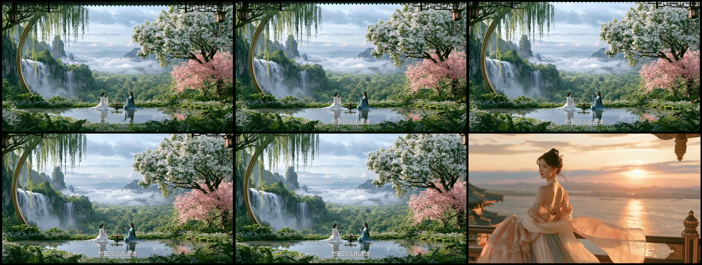

# 《眼儿媚》机制迁移：从真实拉片到可生成分镜

这是一个已经完成“参考片证据 → 分析 → 结构映射 → 逐秒脚本 → 独立分镜 → 分段视频提示词”的真实项目存档，用来展示本 Skill 如何把一条参考视频变成可执行的生产包。

> 边界：该案例保留了生成前的分析与设计交付物，**不包含也不宣称已有该项目的最终 MP4**。它没有通过当时的机器化生成前门禁，恢复生产前应重新执行当前版本的质量门禁。仓库只展示用于分析的低清关键帧拼图，不分发参考原片或原音轨。

## 参考片证据

| 项目 | 已核验事实 |
|---|---|
| 参考片 | 《眼儿媚》古风视觉短片 |
| 时长 / 画幅 | 18.067 秒 / 1280 × 720 / 30 fps |
| 文件身份 | SHA-256：`2b169bd5d243255ceac63ab548e13fe84e6746d175401e17af1b3c3fad379744` |
| 审看范围 | 全片固定 0.5 秒时间线 36 张；场景关键帧 9 张；前 3 秒 2 fps 密集帧 6 张 |
| ASR | Paraformer v2、v1 均运行；字词差异均标记为“需复核”，未直接当作角色对白 |

完整拉片结论见 [参考片分析](./reference_analysis.md)，双模型字幕差异的原始对照见 [ASR 证据摘要](./asr_evidence.md)。

## 从 R 节拍到可生成资产

| 阶段 | 本案例产物 | 真实内容 |
|---|---|---|
| R：拉片 | [参考片分析](./reference_analysis.md) | 9 组画面意象、镜头/动作/声音账本、黄金三秒与传播机制 |
| S：结构迁移 | [结构映射](./structure_mapping.md) | `R01–R09` 映射为 30 秒的 `S01–S09`，明确保留/替换项 |
| 脚本 | [逐秒脚本](./script.md) | 3 个 10 秒 Clip，写清站位、动作、视线、旁白与转场连续性 |
| 视觉设定 | [角色设定表](./character/character_sheet.png) | 所有分镜和三个 Clip 共用的角色身份、发型与服装锚点 |
| B：分镜 | [11 张独立分镜](./storyboard/) | 9 个镜头锚点 + 2 张跨 Clip 连续帧 |
| P：生成 | [Seedance 分段提示词](./seedance_prompts.md) | 每个 Clip 的参考附件、时长、镜头、声音、负面约束与连续帧要求 |

这套案例选择的是“爆款机制迁移”：保留原片的仙境尺度、远近景交替、冷暖光色弧线与结尾朝镜头行走，但将原片的诗词朗读改写为全新的双人逛吃卡叙事；不复制原片音轨或直接拼接原素材。

## 如何复用这份演示

1. 先打开 [参考片分析](./reference_analysis.md)，确认“逐帧”是固定时间线、关键帧与重点区间密集抽帧，不是假装逐一审看全部编码帧。
2. 打开 [结构映射](./structure_mapping.md)，检查每个 `Rxx → Sxx → Bxx → Pxx` 是否有唯一归属。
3. 在 [逐秒脚本](./script.md) 与 [分镜目录](./storyboard/) 之间核对人物、视线、动作方向、旁白和转场。
4. 需要生成时，把 [Seedance 分段提示词](./seedance_prompts.md) 与对应的[角色设定表](./character/character_sheet.png)、分镜、连续帧一并提供给视频模型，再运行当前版本的质量门禁。

成片示意在仓库根目录的“看得到的结果”一节；它们用于展示最终竖版短视频效果，但不声称是本案例的最终渲染版本。
